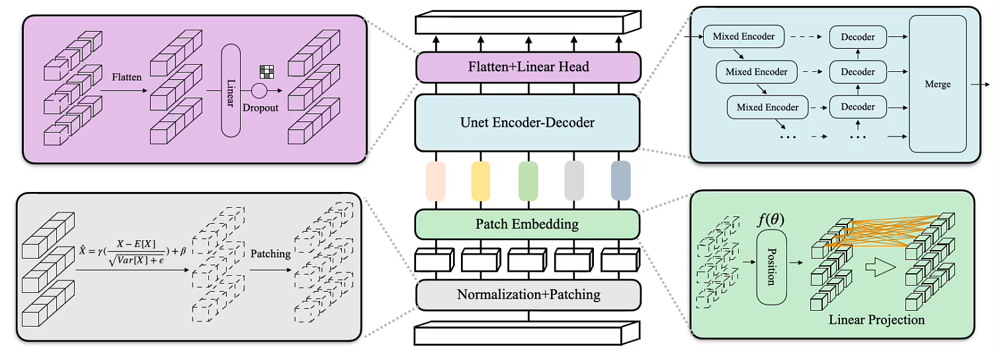

# <center>LSM</center>


### Welcome to the official repository of: [New Perspectives on Multivariate Time Series Forecasting: Lightweight Networks Combined with Multi-Scale Hybrid State Space Models]. 

## Requirements

 Install requirements. ```pip install -r requirements.txt```

## Data

https://drive.google.com/drive/folders/13Cg1KYOlzM5C7K8gK8NfC-F3EYxkM3D2?usp=sharing or https://pan.baidu.com/s/1r3KhGd0Q9PJIUZdfEYoymg?pwd=i9iy

## Acknowledgement

We are deeply grateful for the valuable code and efforts contributed by the following GitHub repositories. Their contributions have been immensely beneficial to our work.
- U-Mixer (https://github.com/XiangMa-Shaun/U-Mixer)
- iTransformer (https://github.com/thuml/iTransformer)
- Mamba (https://github.com/state-spaces/mamba)
- PatchTST (https://github.com/yuqinie98/PatchTST)
- RevIN (https://github.com/ts-kim/RevIN)
- Reformer (https://github.com/lucidrains/reformer-pytorch)
- Informer (https://github.com/zhouhaoyi/Informer2020)
- FlashAttention (https://github.com/shreyansh26/FlashAttention-PyTorch)
- Autoformer (https://github.com/thuml/Autoformer)
- Stationary (https://github.com/thuml/Nonstationary_Transformers)
- Time-Series-Library (https://github.com/thuml/Time-Series-Library)


If you have any questions or suggestions, feel free to contact:
Fei Hao (2023110334@m.ldu.edu.cn)
Xiaofeng Zhang (iamzxf@ldu.edu.cn)

